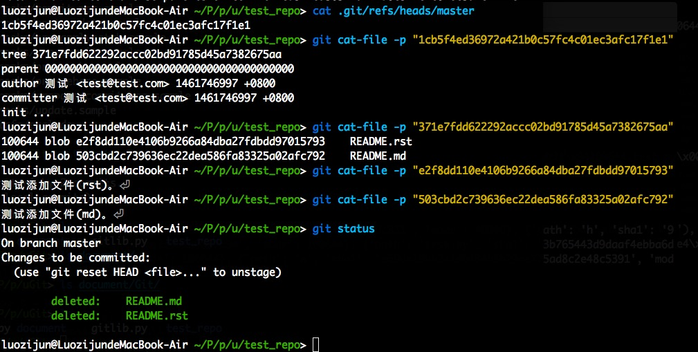

uGit
====

:Date: 04/27 2016

.. contents::

使用
----------

.. code:: python

    # Test
    def test_ls_files(git_work_tree):
        data   = open(os.path.join(git_work_tree, '.git', 'index') ,'r').read()
        data   = utils.decompress(data)
        result = Index.decode(data)
        for k in result.keys():
            print k
            if type(result[k]) != list:
                print result[k]
            else:
                for elem in result[k]:
                    print elem
    def test_create_git_repo(path):
        git = Git(workspace=path, email="test@test.com", name="测试")
        git.init()

    def test_commit(path):
        git = Git(workspace=path, email="test@test.com", name="测试")
        git.add(path="README.rst", content="测试添加文件(rst)。")
        git.add(path="README.md", content="测试添加文件(md)。")
        print git.commit(comment="init ...")

